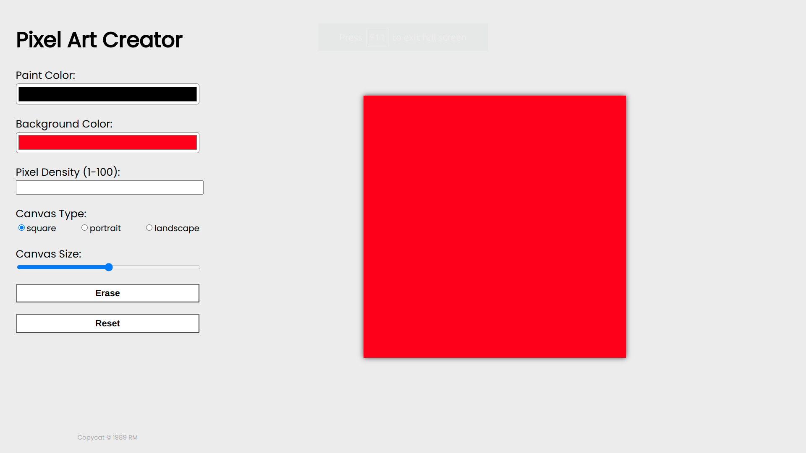

# PixelArtCreator

[Link to live demo.](https://rosendo-martinez.github.io/pixel-art/) 👈

This project implements DOM manipulation, and JS code. 

Project Features:
- Dynamic canvas size and type
- Dynamic pixel density
- Dynamic canvas background color
- Dynamic painting color
- Eraser
- Reset canvas 

# Screenshots

